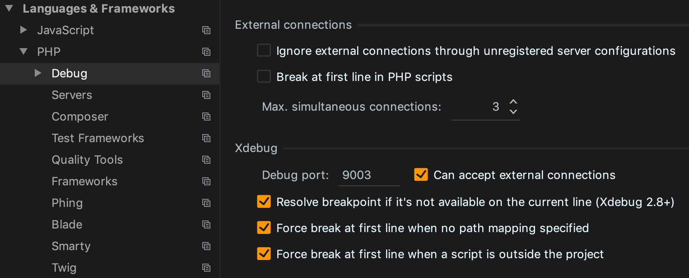

# symfony-skeleton

A skeleton to kickstart new projects, e.g. microservices in a dockerized environment to start coding business logic right away.

Infrastructure:
* PHP 7.4 (soon 8.0)
* PostgreSQL 13
* Symfony 5.2
* Twig
* Doctrine ORM
* Nginx

Dev Tools:
* phpstan
* php-cs-fixer
* Xdebug 3
* Composer 2

## Setup

Browser to directory `dev`

`make setup`

## View in browser

http://symfony-skeleton.dev.local:8100/

## Setup Xdebug 3 in phpstorm

## TODO

- Frontend Framework
- Assets (JS/CSS)
- REST API